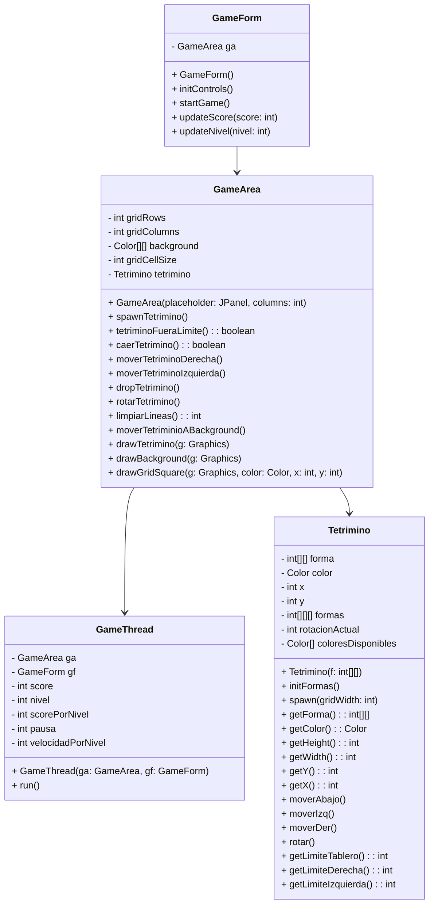

## Estructura de Clases

Proyecto Tetris
Este proyecto Tetris implementa el clásico juego de Tetris en Java, utilizando tres clases principales: GameArea, GameThread, y Tetrimino. Cada una de estas clases cumple un papel importante en la creación y ejecución del juego. A continuación, se proporciona una descripción de estas clases y su funcionalidad:

Clase GameArea (GameArea.java)
La clase GameArea representa el área de juego principal en Tetris. Esta área es donde se muestran y gestionan los tetriminos, y se encarga de las interacciones con el jugador. Algunas de las características clave de esta clase incluyen:

Dibujo de tetriminos en el área de juego.
Manejo de la caída de tetriminos y su movimiento lateral.
Limpieza de líneas completas en el tablero.
Actualización de puntuación y niveles.
Rotación de tetriminos y detección de colisiones.
La clase GameArea extiende JPanel y se utiliza para mostrar la interfaz gráfica del juego en una ventana de juego.

Clase GameThread (GameThread.java)
La clase GameThread es un hilo que controla la lógica principal del juego Tetris. Algunas de las tareas que realiza incluyen:

Inicialización y manejo de la caída de tetriminos.
Detección de colisiones y límites del área de juego.
Gestión de la puntuación y niveles del jugador.
Actualización de la interfaz de usuario.
Este hilo se ejecuta en segundo plano y se encarga de hacer que el juego sea interactivo y dinámico. Controla la caída de tetriminos, realiza comprobaciones de colisión y límites, y actualiza la interfaz de usuario para reflejar la puntuación y el nivel actual.

Clase Tetrimino (Tetrimino.java)
La clase Tetrimino representa una pieza individual del juego Tetris, con una forma, color y posición específicos. Algunas de las funcionalidades de esta clase incluyen:

Creación de tetriminos con diferentes formas y colores.
Inicialización de tetriminos y colocación aleatoria en el área de juego.
Rotación de tetriminos en sentido horario.
Obtención de información sobre la forma, color y posición de un tetrimino.
Los tetriminos son los bloques básicos del juego y pueden rotar y moverse lateralmente a medida que caen hacia abajo en el área de juego.

GameForm
La clase GameForm representa la interfaz gráfica de usuario del juego Tetris. Incluye el área de juego, controles por teclado y la visualización de puntuación y nivel. Esta clase se encarga de iniciar el juego, gestionar los controles por teclado y actualizar la interfaz de usuario en función de la puntuación y el nivel.

Cómo usar el proyecto
Puedes utilizar este proyecto Tetris como base para crear tu propio juego Tetris en Java. El código fuente proporcionado en las clases GameArea, GameThread, y Tetrimino te servirá como punto de partida. Puedes personalizar y ampliar estas clases para añadir más características al juego, como controles de usuario, sonidos y animaciones.

Si deseas ejecutar el juego, asegúrate de tener una máquina virtual Java (JVM) instalada y compila las clases proporcionadas. Luego, ejecuta la clase GameForm para iniciar el juego.

¡Diviértete desarrollando y jugando Tetris!
